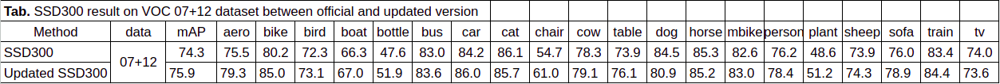

# SSD: Single Shot MultiBox Object Detector, in PyTorch and CUDA11x-12x

A [PyTorch](http://pytorch.org/) implementation of [Single Shot MultiBox Detector](http://arxiv.org/abs/1512.02325).


## Results Between Our and Official Repo
This table demonstrates comparative results between official [ssd.pytorch](https://github.com/amdegroot/ssd.pytorch) and this repository. 




## Installation
The following is an example based on PyTorch 2.4.1 with CUDA 12.4. For other versions, please refer to the official website of [PyTorch](https://pytorch.org/) 

```shell
# create environment
conda env create -f environment.yml
# activate environment
conda activate ssd
```

## Datasets
COCO, VOC2007, VOC2012, CityScapes and FoggyCityScapes datasets are available. 

### COCO
Specify a directory for dataset to be downloaded into, else default is ~/data/
```Shell
sh data/scripts/COCO2014.sh
```

### VOC Dataset
##### Download VOC2007 trainval & test
Specify a directory for dataset to be downloaded into, else default is ~/data/
```Shell
sh data/scripts/VOC2007.sh # <directory>
```
##### Download VOC2012 trainval
Specify a directory for dataset to be downloaded into, else default is ~/data/

```Shell
sh data/scripts/VOC2012.sh # <directory>
```

#### Cityscapes, Foggy Cityscapes
  - Download Cityscapes and Foggy Cityscapes dataset from the [link](https://www.cityscapes-dataset.com/downloads/). Particularly, we use *leftImg8bit_trainvaltest.zip* for Cityscapes and *leftImg8bit_trainvaltest_foggy.zip* for Foggy Cityscapes.
  - Unzip them under the directory like

```
data/cityscapes
├── gtFine
├── leftImg8bit
├── leftImg8bit_foggy
└── ...
```
Then run 
```
python utils/prepare_cityscapes_to_voc.py 
```
This will automatically generate dataset in `VOC` format.
```
data/cityscapes_in_voc
├── Annotations
├── ImageSets
└── JPEGImages
data/foggy_cityscapes_in_voc
├── Annotations
├── ImageSets
└── JPEGImages
```

## Pre-trained Models
* First download the fc-reduced VGG-16 PyTorch base network weights at: https://s3.amazonaws.com/amdegroot-models/vgg16_reducedfc.pth
* By default, we assume you have downloaded the file in the `ssd.pytorch/weights` dir:

```Shell
mkdir weights
cd weights
wget https://s3.amazonaws.com/amdegroot-models/vgg16_reducedfc.pth
```

| Dataset | Backbone | mAP | Weights | 
|:----:|:----:|:----:|:----:|
| [VOC07+12] | VGG | 75.9 | [Link](https://drive.google.com/file/d/1pnXV0QjLRk9_dZdPYSGtVBQax22HMRvK/view?usp=sharing)
| [CityScapes] | VGG | 35.9 | [Link](https://drive.google.com/file/d/1M1PslIeettuReFSZTsjoOcQYBK2M5QAU/view?usp=sharing)

## Train
```Shell
CUDA_VISIBLE_DEVICES=$GPU_ID \
       python train.py \
       --dataset VOC
       --dataset_root <dataset_root> \
       --end_epoch 100 \ 
       --lr 1e-2 
```

## Inference
- For image inference:
```Shell
CUDA_VISIBLE_DEVICES=$GPU_ID python inference.py --image <image_file>
```
- For video inference:
```Shell
CUDA_VISIBLE_DEVICES=$GPU_ID python inference.py --video <video_file>
```

## Acknowledgement
My implementation borrows many parts from [ssd.pytorch](https://github.com/amdegroot/ssd.pytorch) and [I3Net](https://github.com/czzbb/I3Net/tree/main)